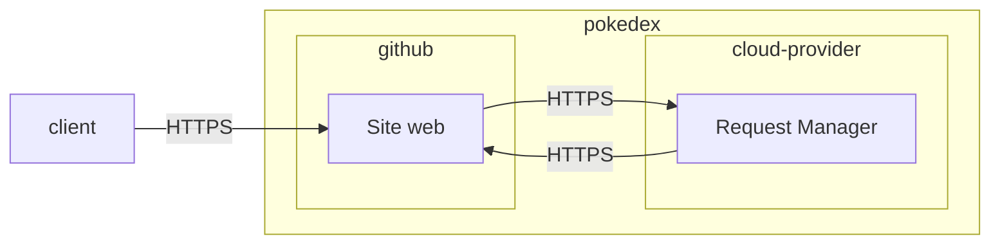

# pokedex-react

## PokemonLegendaryState

Pokédex made in React using the Poképedia API.

This project was bootstrapped with [Create React App](https://github.com/facebook/create-react-app).

## 🚀🚀[you can try the pokedex by clicking here](https://im-rises.github.io/pokedex-react/) 🚀🚀

<!--
## Overview

1. [API used](#api-used)
2. [Components](#components)
3. [Available Scripts](#available-scripts)
    1. [start the app](#yarn-start)
    2. [unit test](#yarn-test)
    3. [build the app](#yarn-build)
    4. [eject the app](#yarn-eject)
4. [learn more](#learn-more)
    1. [code splitting](#code-splitting)
    2. [analyzing the bundle Size](#analyzing-the-bundle-size)
    3. [Making a progressive Web App](#making-a-progressive-web-app)
    4. [Advanced configuration](#advanced-configuration)
    5. [Deployment](#deployment)
-->

## API used

- [pokepedia](https://pokeapi.co)
- [react-gh-pages](https://github.com/gitname/react-gh-pages)
- https://gist.github.com/apaleslimghost/0d25ec801ca4fc43317bcff298af43c3

<!--
## Components

| Components Name        |                          its purpose                          |                    How to use it                    |
|:-----------------------|:-------------------------------------------------------------:|:---------------------------------------------------:|
| CommonSprites          |      show all common sprites by given the pokemon wanted      |      `<CommonSprites pokemon={"charmander"}>`       |
| DreamWorldSprites      |   show all Dream World sprites by given the pokemon wanted    |    `<DreamWorldSprites pokemon={"charmander"}>`     |
| HomeSprites            |       show all Home sprites by given the pokemon wanted       |       `<HomeSprites pokemon={"charmander"}>`        |
| OfficialArtworkSprites | show all Official Artwork sprites by given the pokemon wanted |  `<OfficialArtworkSprites pokemon={"charmander"}>`  |
| ShowAllSpriteOfObject  |   show all url with their name in caption from object given   | `<ShowAllSpriteOfObject ObjectOfUrl={ObjectOfUrl}>` |
| Sprite                 |           show an image by its URL with its legend            |          `<Sprite url={url} name={name}/>`          |
| VersionSprite          |       show all pokemon sprites generation by generation       |        `<VersionSprite pokemon={pokemon}/>`         |
| PokemonNumber          |              show the pokemon number by its name              |        `<PokemonNumber pokemon={pokemon}/>`         |
| PokemonName            |        show the pokemon name in the selected language         |         `<PokemonName pokemon={pokemon}/>`          |
| PokemonDescription     |     show the pokemon description in the selected language     |      `<PokemonDescription pokemon={pokemon}/>`      |
| PokemonLegendaryState  |  show the pokemon legendary boolean in the selected language  |    `<PokemonLegendaryState pokemon={pokemon}/>`     |
| PokemonMythicalState   |  show the pokemon mythical boolean in the selected language   |     `<PokemonMythicalState pokemon={pokemon}/>`     |
-->

## Documentations

- [React](https://reactjs.org/docs/getting-started.html)
- [Pokeapi](https://pokeapi.co/docs/v2.html)
- [React-gh-pages](https://github.com/gitname/react-gh-pages)
- [EsLint](https://eslint.org/docs/user-guide/getting-started)

## GitHub Actions

- CodeQL: Code scanning alerts
- ESLint: Linting
- Node.js CI: Continuous Integration (CI) for Node.js
- gh-pages-publish: Publish to gh-pages branch
- pages-build-deployment: Build and deploy to pages

## Organization

it's based on the NATIONAL pokédex THE LAST VERSION

it loads all photos IN ONCE but if it's lags too much, it will be updated step by step

from a pokémon, we show only official artworks from pokémon (because they're cutty)

- [x] create all the function requests
    - [x] get all names C
    - [x] get all icons C
    - [x] get all numbers (National) Q => passed in pokémon description
    - [x] from a pokemon
        - [x] get his type Q
        - [x] get his photo C
        - [x] get all descriptions with pkm version Q

### isolation website idea

## Authors

- [@clementreiffers](https://www.github.com/clementreiffers)
- [@im-rises](https://www.github.com/im-rises)

